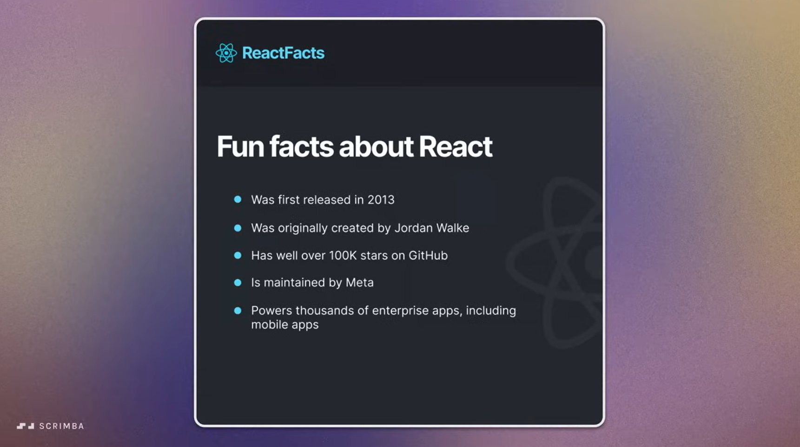
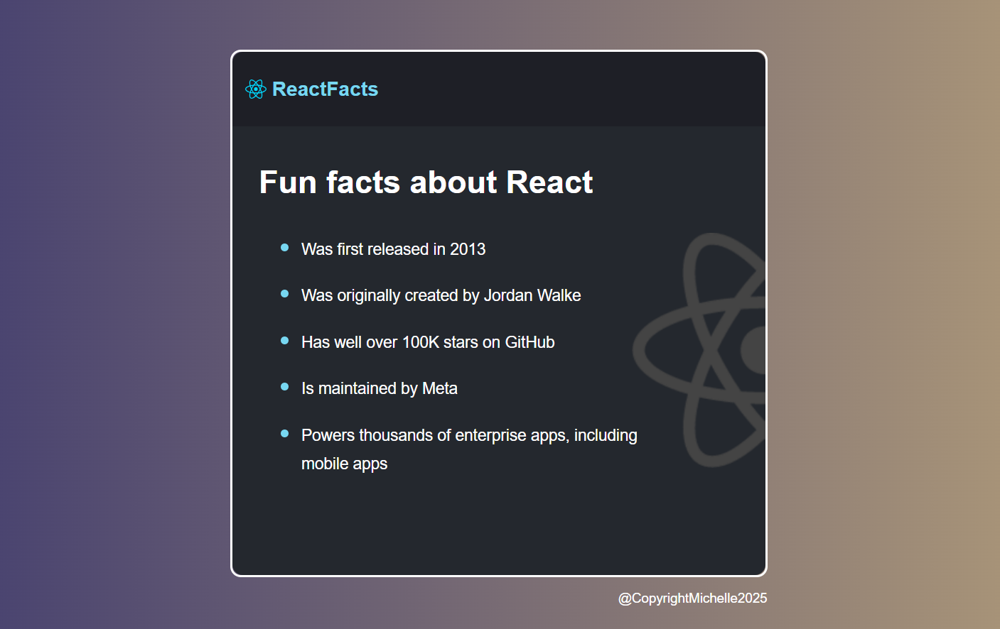

# 🧠 React Fun Facts

This is my **first React app**, built as part of the [Scrimba Learn React course](https://www.youtube.com/watch?v=x4rFhThSX04&t=495s).  
It's a simple static page that displays a list of fun facts about React using reusable components and basic CSS styling.

## 🚀 Project Overview

The goal of this mini project was to practice:

- Writing JSX
- Creating functional components (`Navbar`, `MainContent`, `Footer`)
- Styling a React app

The result is a fun, clean-looking page that introduces some cool facts about React!

## 🎯 Learning Outcome

I learned how to:

- Set up a React app with Vite
- Organize my UI using components
- Use Flexbox and gradients for layout and styling
- Embed images in React

## 📸 Demo Comparison

Here’s a side-by-side of the original Scrimba project goal vs. my final result:

### 🎓 Scrimba Project Goal

### 🛠 My Demo

## 🛠 How to Run Locally

1. Clone the repo
2. Navigate into the folder
3. Install dependencies  
   `npm install`
4. Start the dev server  
   `npm run dev`

> This project uses [Vite](https://vitejs.dev/) for fast setup and hot reloading.

---
